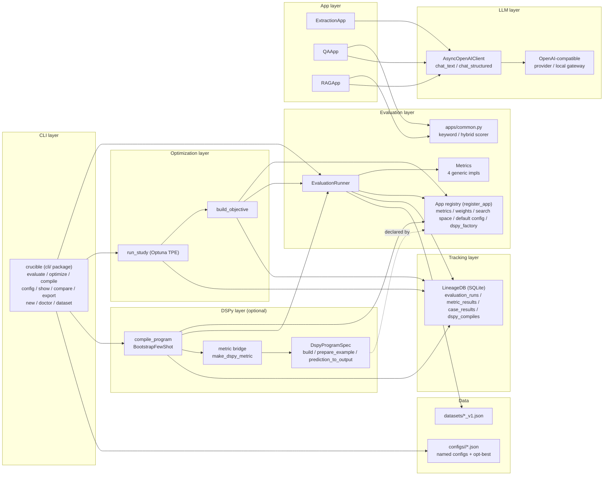
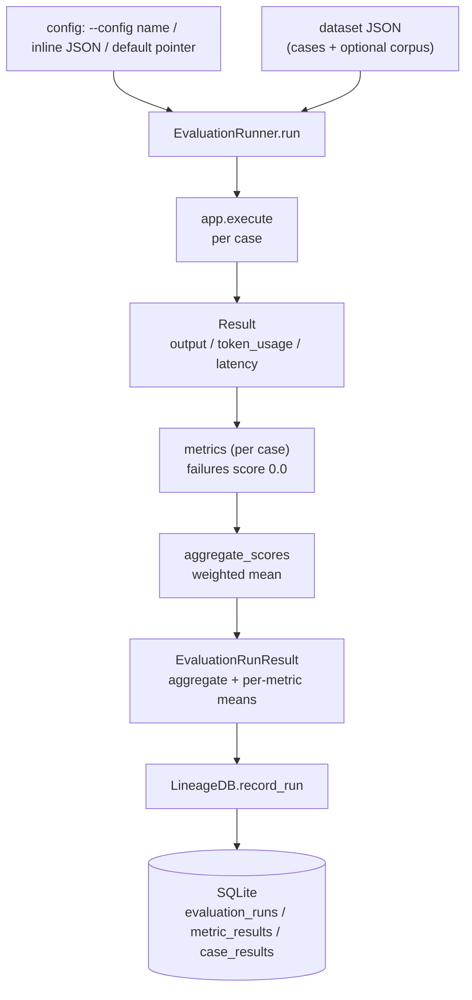
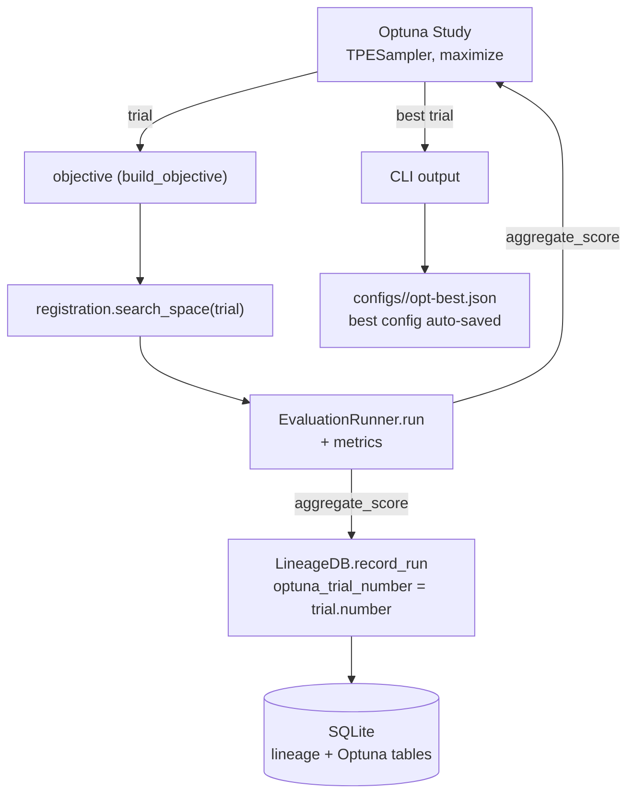
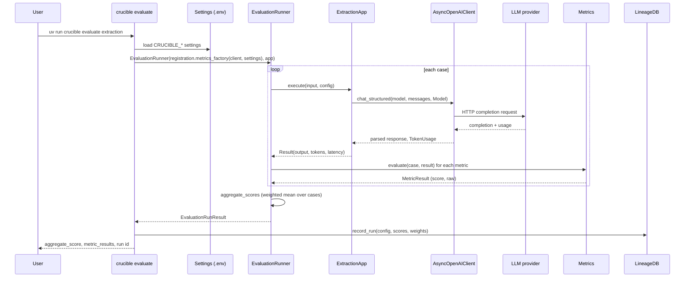
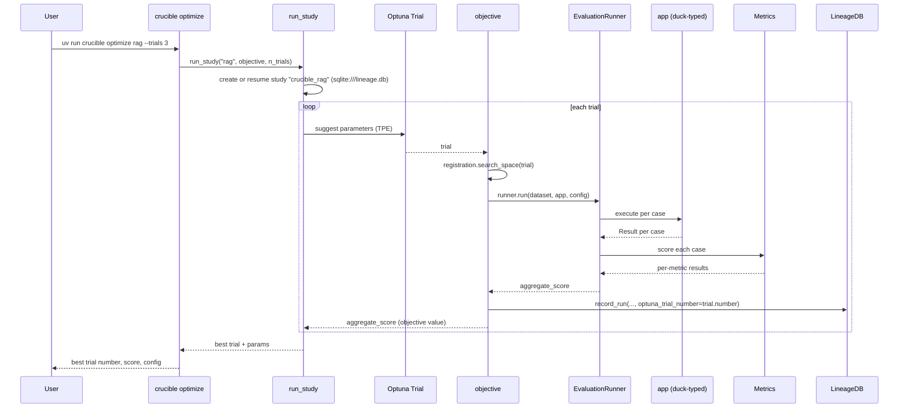
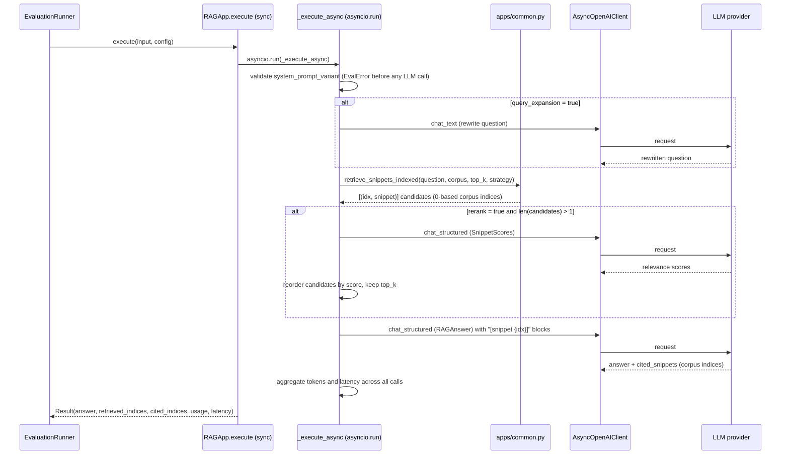
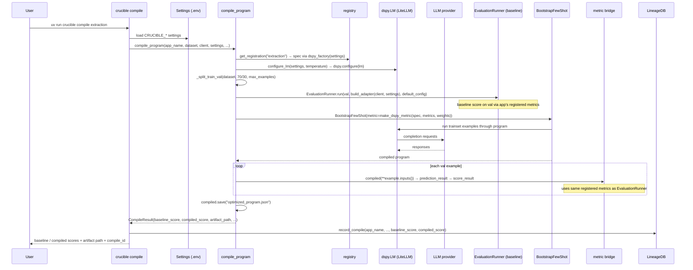

# Crucible — Architecture

## 1. High-level system concepts

Crucible is organized as five layers, each with a narrow seam (a Protocol or a registry):

```
CLI / optimize → evaluation → apps → LLM client → provider gateway
                       ↓
                  tracking (SQLite lineage)
```

**Application adapter.** An app is any object with `execute(input: dict, config: dict) -> Result` — duck-typed, no protocol class (the framework calls the method on whatever the app registration's `build_adapter` returned). A `Result` carries the app's `output` (dict or str), `token_usage`, and `latency_seconds`. This duck typing makes every app — from a single structured call to a four-stage pipeline — look identical to the evaluation engine.

**Sync-over-async facade.** The public app API is synchronous; apps internally wrap the async `AsyncOpenAIClient` with `asyncio.run(...)`. The RAG app is the exception: its whole pipeline (expansion → retrieval → rerank → generation) runs inside one `asyncio.run` per case so token usage and latency can be aggregated across its calls.

**Configuration.** A config is a plain dict of parameter values, e.g. `{"temperature": 0.0, "top_k": 3, "system_prompt_variant": "strict"}`. Each app declares its search space, default config, metric set, and weight scheme in its `apps/*.py` module and registers them via `register_app` (`registry.py`). Named configs can be saved as versionable JSON files under `configs/<app>/<name>.json` (managed through the `config` CLI group) and referenced by name with `--config`; when `--config` is omitted, `evaluate` falls back to a per-app default pointer (`configs/<app>/.default`) or the app's registered default config. `optimize` writes the best trial's config to the reserved `configs/<app>/opt-best.json`.

**Command-line interface.** `crucible` is a `click` group living in the `src/crucible/cli/` package. Importing the package runs `discover_apps()` to load registered apps, then wires subcommands across focused modules: `evaluate`, `optimize`, `compile`, `config_cmds` (the `config` group), `readback` (`show` / `compare` / `export`), and `devtools` (`new`, `doctor`, `dataset`). Shared helpers (`_client`, `_load_run_context`, `_resolve_run_id`, ...) live in `cli/context.py`, which acts as a call-time seam so commands resolve helpers through `context.X(...)` at call time and tests can monkeypatch them.

**Dataset.** A versioned JSON file: `{"version": "rag_v1", "corpus": [...], "cases": [{"id", "input", "expected"}]}`. `corpus` is optional (retrieval apps only). Retrieval apps use 0-based corpus indices as snippet identity, so RAG `expected` carries `source_indices`.

**Metrics and weight schemes.** A metric is a `Metric` protocol: `evaluate(case, output) -> MetricResult`. Metrics are pure score functions (deterministic) or LLM judges (`llm_judge`). The framework ships four generic metrics (fuzzy match, LLM judge, latency, cost); app-specific metrics (exact match, retrieval recall, citation accuracy) live in the app modules that register them. Each app bundles its metric set and weight scheme — over its metric names, summing to 1.0 — plus its search space and default config into an `AppRegistration` via `register_app`; the aggregate score is the weighted mean of per-case weighted sums. A failing case or metric scores 0.0 and never aborts the run.

**Lineage.** Every run — baseline evaluation or optimization trial — is written to SQLite: `evaluation_runs` (config, aggregate score, optional `optuna_trial_number`), `metric_results`, and `case_results`. `evaluation_runs` also carries the run's `model_name` (the model axis is orthogonal to config, so the same config can be compared across models) and normalized `tags`; `case_results` includes a nullable `error` column so per-case failures are persisted, not just scored as 0.0. DSPy compile artifacts have their own table `dspy_compiles` (compile_id, optimizer, baseline/compiled scores, artifact path) — kept separate from evaluation runs because compile and Optuna are independent optimization axes. The same SQLite file also stores Optuna's own tables, so trial history and lineage live together. Schema upgrades are additive: `LineageDB._backfill_columns` runs guarded `ALTER TABLE ... ADD COLUMN` statements so pre-existing databases gain new columns without losing rows.

**DSPy compile (optional).** A second, orthogonal optimizer: DSPy optimizes *LLM behavior* (prompts, demos, reasoning patterns via `BootstrapFewShot`) while Optuna optimizes *application config* (temperatures, top_k, strategy flags). Apps that declare a `dspy_factory` on their `AppRegistration` return a `DspyProgramSpec` (three callables: `build` fresh program, `prepare_example` case→dspy.Example, `prediction_to_output` pred→app output dict). The compile harness (`src/crucible/dspy/`) splits the dataset 70/30, runs a baseline evaluation on val, compiles with `BootstrapFewShot` using a metric bridge that scores via the app's registered metrics (same objective as `crucible evaluate`), evaluates the compiled program on val, saves the artifact JSON, and records compile lineage. At evaluate time, `--program <path>` loads the artifact into `build_adapter`; apps fall back to hardcoded prompts when no program path is given. DSPy is an optional dependency (`uv sync --group dspy`); all `import dspy` calls are lazy and raise a clear `EvalError` with install instructions if the group is absent.

**Optimization.** An Optuna study per app (`crucible_{app}`, TPE sampler, `load_if_exists=True` so runs resume). Each trial samples a config, runs a full evaluation, records lineage with the trial number, and returns the aggregate score for maximization. When the study finishes, the best trial's config is written to `configs/<app>/opt-best.json` (overwritten each run) and its path is printed in the CLI output.

**Structured output.** Apps that need JSON responses use `chat_structured` with a pydantic response model; the client forces JSON via schema in the prompt, strips markdown fences, and retries with a repair pass on parse failure.

## 2. Component diagram



## 3. Data flow diagrams

### 3.1 Evaluate flow (baseline run)



### 3.2 Optimize flow (trial loop)



## 4. Sequence diagrams

### 4.1 Baseline evaluation (`crucible evaluate extraction`)



### 4.2 Optimization (`crucible optimize rag --trials 3`)



### 4.3 RAG app pipeline (one case, one event loop)



### 4.4 DSPy compile (`crucible compile extraction --max-examples 20`)


